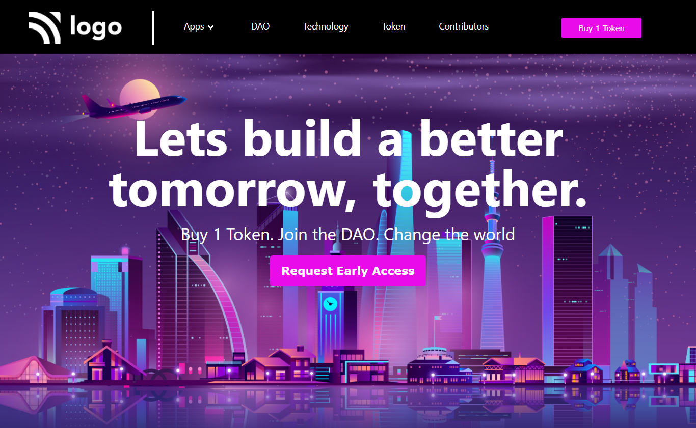

# Project 5

## Community Landing Page

### 🌏 A Landing Page of a Gobal community that will help us to build a better world together.🌲

  

#### Built Using HTML & CSS (Desktop view Only 💻)

#### Time Taken to finish the Project - 2.45 hours ⌛ (approx)

---

## Things learned from project -

- 
- 
- 

---

## Live Demo [Demo](https://manas-ranjan-murmu-project5.netlify.app/)

### Screenshot

---
